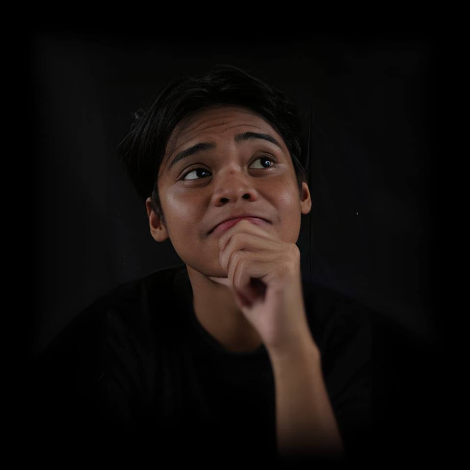

<h1 style="text-align:center; margin-bottom:10px;">Welcome to My Porfolio!</h1>

  <!-- LEFT SIDE: PIC + BASIC DETAILS -->
  

    

    

      <h2 style="margin:0; color:#00bcd4;">Noel Justine Diaz</h2>
      
🎓 BS Computer Science Student

      
🏫 City College of Angeles

      
💻 Focus: Python, Object-Oriented Programming

      
📫 <a href="mailto:ndiaz24-0189@cca.edu.ph" style="color:#00bcd4;">ndiaz24-0189@cca.edu.ph</a>

    

  

  <!-- RIGHT SIDE: FUN FACTS -->
  

    <h3 style="margin-top:0; color:#00bcd4;">Fun Facts About Me</h3>
    <ul style="margin:0; padding-left:20px;">
      <li>Before college, I had little-to-zero knowledge about programming.</li>
      <li>I like casual talking with someone while coding or doing projects.</li>
    </ul>
  

 
## Area of Interest

 
  

    <h3>🎬 Movies and Series</h3>
    
Animations

    
Horror

    
Fantasy

  

  

    <h3>🍳 Cooking and Baking</h3>
  

 
## Languages I used before 

 
  
&nbsp;&nbsp;

&nbsp;&nbsp;
  
&nbsp;&nbsp;

 
## My Projects

  <!-- LEFT (Midterm) -->
  

    <h3>MIDTERM</h3>
    
📂 LAB TASK 1 - <a href="MIDTERM/Lab1/">PYTHON FUNDAMENTALS</a>

    
📂 LAB TASK 2 - <a href="MIDTERM/Lab2/">LOOPS AND FUNCTIONS</a>

    
📂 LAB TASK 3 - <a href="MIDTERM/Lab3/">LIST COLLECTION</a>

    
📂 LAB TASK 4 - <a href="MIDTERM/Lab4/">DICTIONARY COLLECTION</a>

    
📂 LAB TASK 5 - <a href="MIDTERM/Lab5/">CLASS AND OBJECTS</a>

  

  <!-- RIGHT (Finals) -->
  

    <h3>FINALS</h3>
    
📂 LAB TASK 1 - <a href="FINALS/Lab1/">ENCAPSULATION</a>

  

 
##  Click Below to Connect with Me!   

  
  &nbsp;&nbsp;
  
  &nbsp;&nbsp;
  
 

