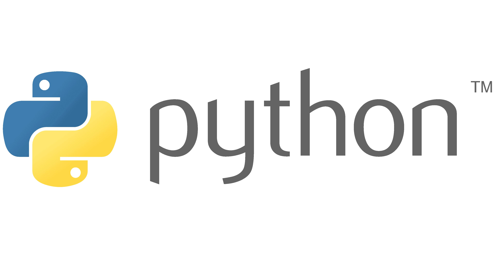

 
  

  
  

    <h1 style="margin:0; color:#00bcd4; font-size:2.2em;">
      Noel Justine Diaz
    </h1>

    

      🎓 BS Computer Science Student  
       🫠City College of Angeles  
       💻 Python & Object-Oriented Programming  
    

    

      <a href="mailto:ndiaz24-0189@cca.edu.ph" 
         style="color:#00bcd4; font-size:1.1em;">
        📫 Contact Me
      </a>
    

  

## Area of Interest

  
  

    <h3 style="color:#00bcd4; margin-bottom:8px;">🎬 Movies & Series</h3>
    <ul>
      <li>Animations</li>
      <li>Horror</li>
      <li>Fantasy</li>
    </ul>
  

  

    <h3 style="color:#00bcd4; margin-bottom:8px;">🍳 Cooking & Baking</h3>
    
I enjoy exploring recipes and experimenting with food.

  

## Languages I used before 

 
  
&nbsp;&nbsp;

&nbsp;&nbsp;
  
&nbsp;&nbsp;

## My Projects

  

    <h3 style="color:#00bcd4;">MIDTERM</h3>
    
📂 <a href="MIDTERM/Lab1/">Lab Task 1 — Python Fundamentals</a>

    
📂 <a href="MIDTERM/Lab2/">Lab Task 2 — Loops & Functions</a>

    
📂 <a href="MIDTERM/Lab3/">Lab Task 3 — List Collection</a>

    
📂 <a href="MIDTERM/Lab4/">Lab Task 4 — Dictionary Collection</a>

    
📂 <a href="MIDTERM/Lab5/">Lab Task 5 — Class & Objects</a>

  

  

    <h3 style="color:#00bcd4;">FINALS</h3>
    
📂 <a href="FINALS/Lab1/">Lab Task 1 — Encapsulation</a>

  

##  Fun Fact About Me:  

- Before I started my college, I have little-to-zero knowledge about programming and computing.  
- I like to casual talk to someone when I am doing projects, programming, etc.  

##  Click Below to Connect with Me!   

  
  &nbsp;&nbsp;
  
  &nbsp;&nbsp;
  
 

